# Azure Load Testing Service: Overview

## Key Takeaways

In this demo, you'll get an overview of Azure's Load Testing Service; a managed service that can be used to simulate load on your application's APIs.

You'll also get an insight into how to use Azure Monitor to monitor the application's performance and health.

All these are especially crucial for an e-commerce application like Contoso Traders, which is expected to instantly handle a large, sudden spike in number of users, with low latency and no downtime.

## Before You Begin

* There are some prerequisites for this demo mentioned in the [application deployment guide](../app-deployment-guide.md). After executing all the steps mentioned in that document, the application's infrastructure will be provisioned on Azure, and the latest code will be deployed as well.

## Walkthrough: Identify the Load Test Target

1. In the Azure portal, you can navigate to the Azure Container App in the `contoso-traders-rg` resource group. This is the application that hosts the `Carts API`.

   

2. You can get the URL of the `Carts API` by as shown below.

   

3. In a separate browser tab, enter the following url in the address bar to load the API's swagger page: `<ACA url>/swagger/index.html`

   

4. You can now identify the API that you want to load test. In this case, we'll be load testing the `Carts API`'s `GET <ACA url>/v1/ShoppingCart/loadtest` endpoint. Please note down this endpoint for later use.

   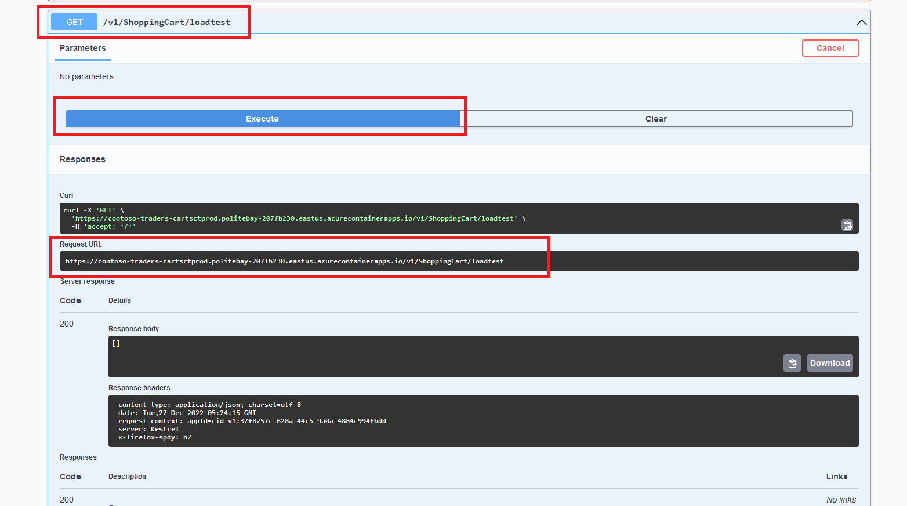

## Walkthrough: Metrics & Dashboards

1. In the Azure portal, you can navigate to the Azure Container App in the `contoso-traders-rg` resource group.

   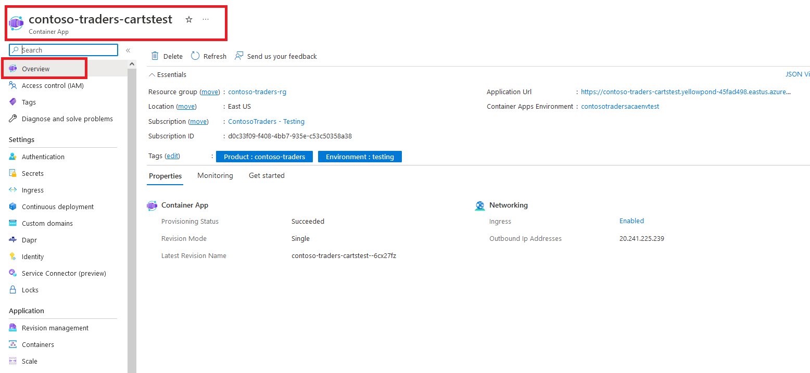

2. For demo purposes, we have configured a `HTTP Scaling` rule that horizontally scales out additional replicas when the number of concurrent requests exceeds a threshold (`3` in this case). ACA also supports automatic scale-in to zero when traffic dips below threshold.

   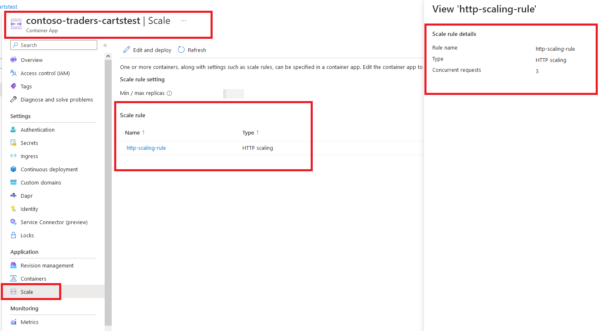

3. In the metrics tab, you can see the various metrics measured & published by the ACA infrastructure. You can create a metric chart that combines two metrics: `replica count` vs `requests`. This will help you visualize the increase in replica count under load.

   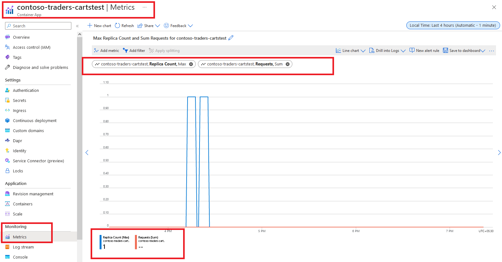

4. Finally, you can pin this metric chart to the dashboard for easy access. This dashboard can be a shared-team dashboard, or a private dashboard.

   

## Walkthrough: Creating a Load Test

1. In the Azure portal, you can navigate to the Azure Load Testing service in the `contoso-traders-rg` resource group.

   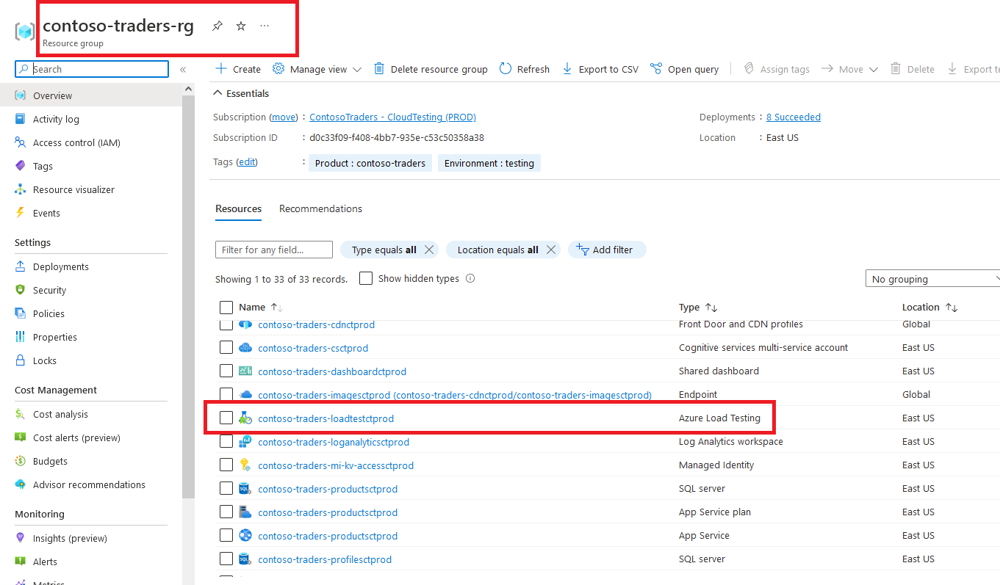

2. You can create a new load test as follows: Navigate to the `Tests` section, and then click on `Create` > `Create a Quick Test` button.

   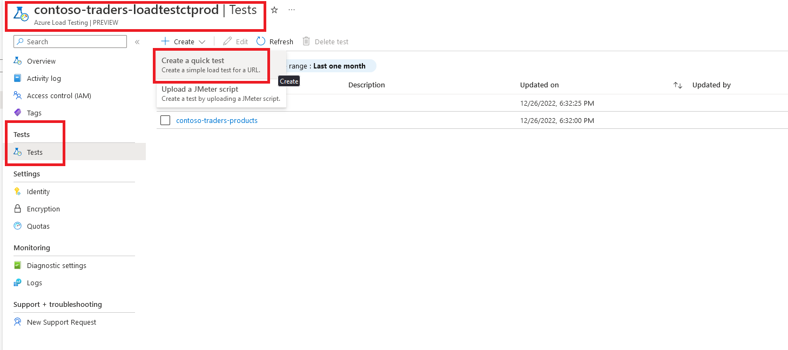

3. In the `Quick Test` blade, you can specify the name of the load test, and the target URL. You can also specify the number of concurrent users, and the duration of the test. See example below:

   

> **Note**: The target URL is the URL from the `Carts API` that you identified in the previous section.

## Walkthrough: Running the Load Test

1. Once you've entered the load test specifications above, you can run it by clicking on the `Run` button.

   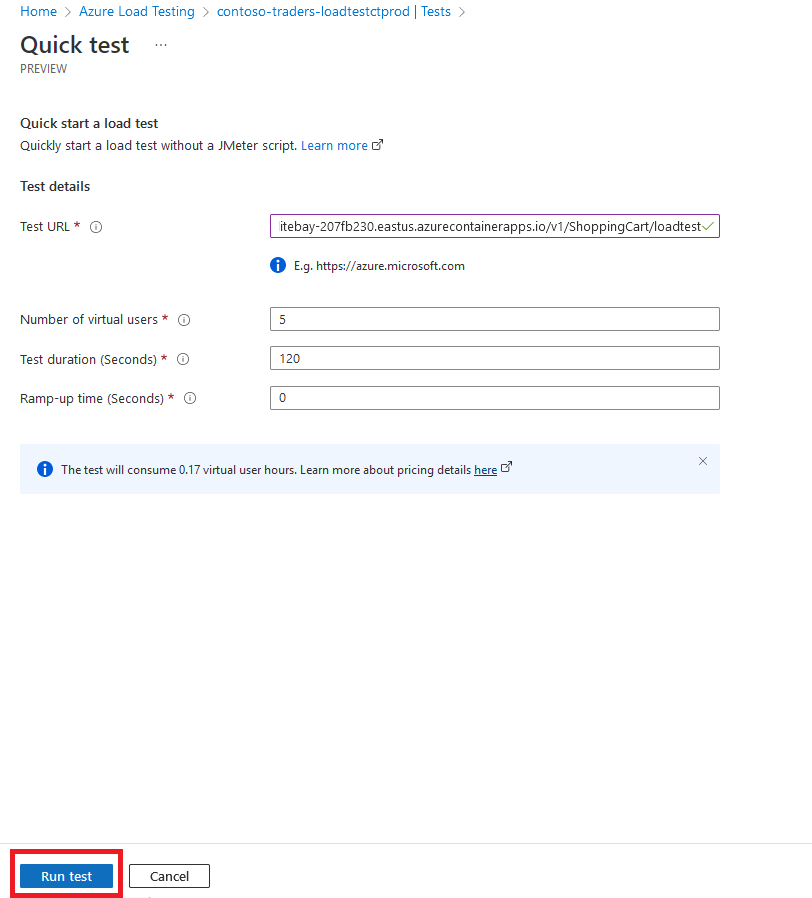

2. The load test will take about 2 minutes to complete. Once done, it'll display the summary and client-side metrics.

   

   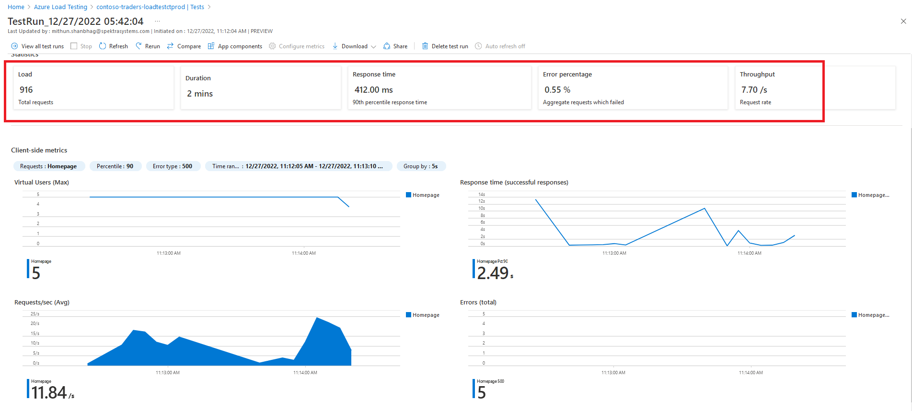

## Walkthrough: Incorporate Server Side Metrics

1. Click on the `App Components` button. Then from the flyout, select the `contoso-traders-carts` CosmosDB component. This will add relevant metrics from the CosmosDB to the load test dashboard.

   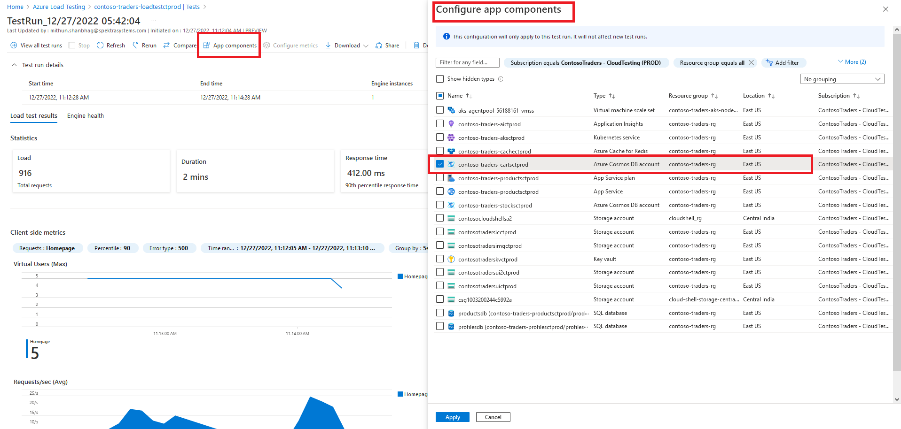

2. Re-run the load test, and you'll see the impact of the synthetic load on the DB (in real-time).

   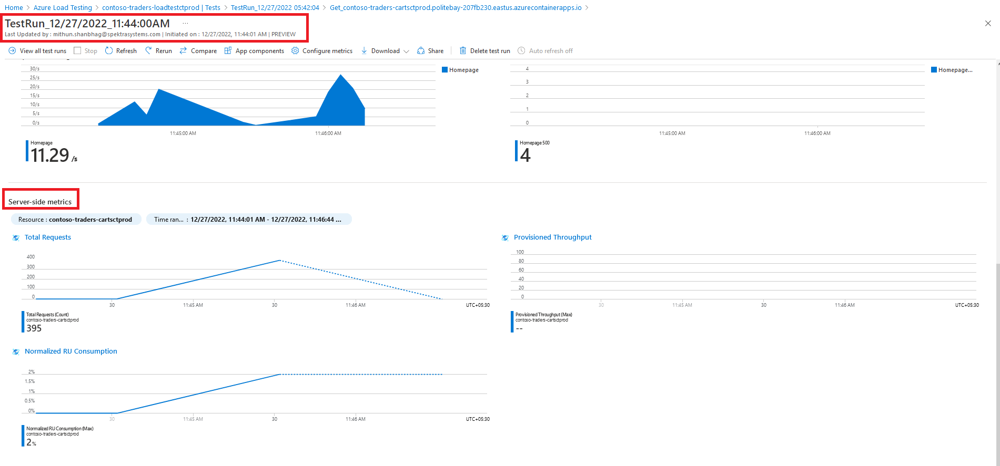

> **Note**: Unfortunately, ACA metrics are not yet supported in Azure Load Testing's server side metrics. This feature will be coming soon.

## Walkthrough: Monitoring the Load Test

## Walkthrough: Load Testing

1. We have a GitHub workflow that executes load tests on the application's APIs. This workflow is automatically triggered on every checkin to the `main` branch. Specifically the load tests are run on the `Product API` and `Carts API` immediately after they're deployed to the AKS cluster and ACA respectively.

   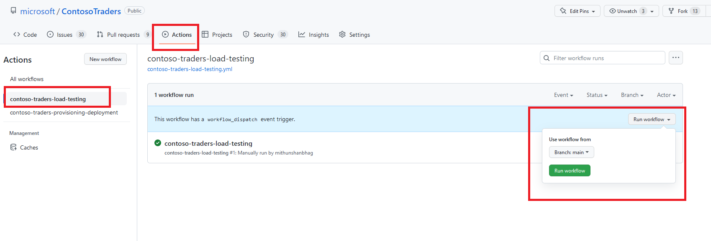

2. The workflow uses a github action to invoke the [Azure Load Testing](https://learn.microsoft.com/en-us/azure/load-testing/) service and simulates load on the application's `Product API` and `Carts API`, which are hosted on AKS and ACA respectively.

   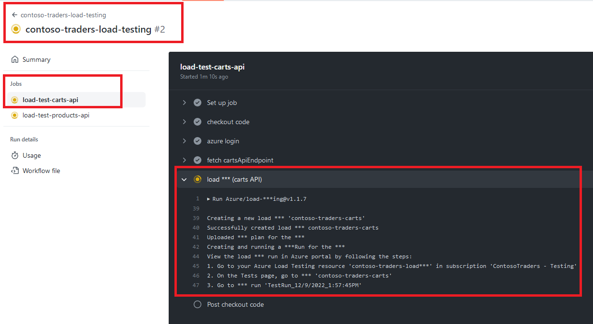

   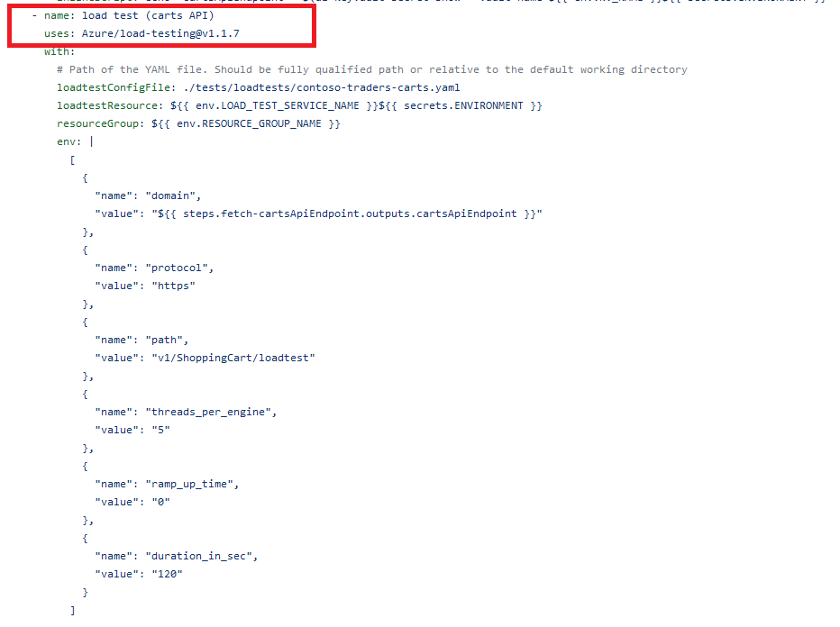

3. The load test takes about 2 minutes to execute. Once done, you can navigate to the Azure Portal to get more in-depth details about the test.

   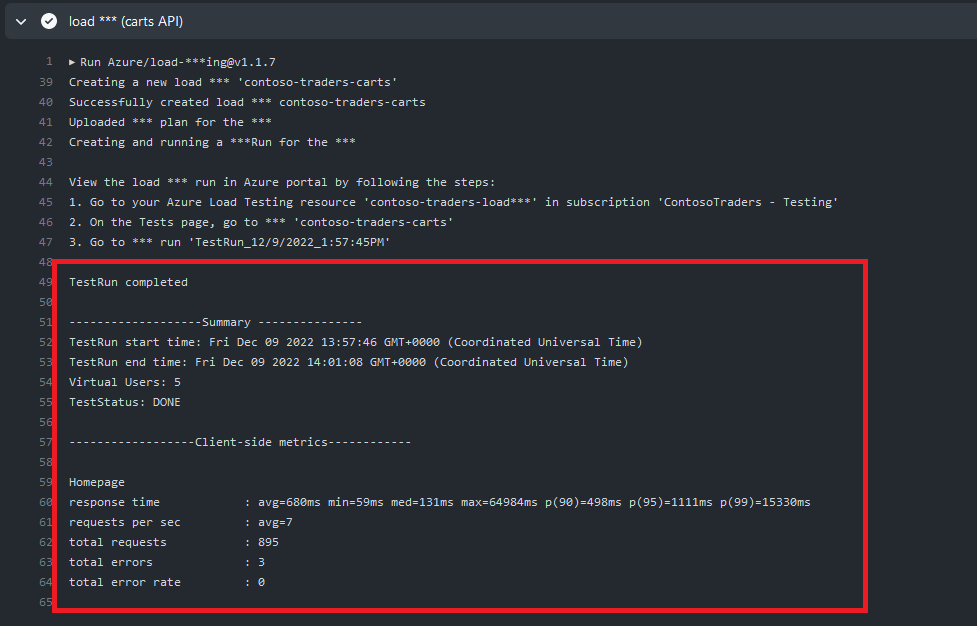

   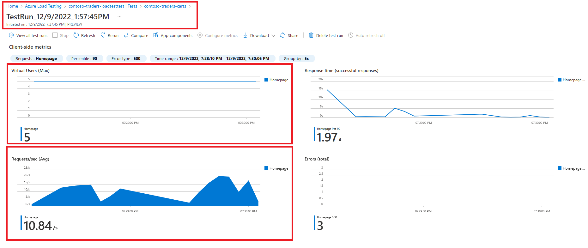

4. You can also direct the load testing service to extract & correlate metrics from the concerned Azure Services. This will give you a great overview of how the various APIs/databases performed under load, whether the users got throttled/rate-limited, whether the average round-trip latency increased etc. In the example below, it has correlated metrics from Azure CosmosDB (which is used by Carts API).

   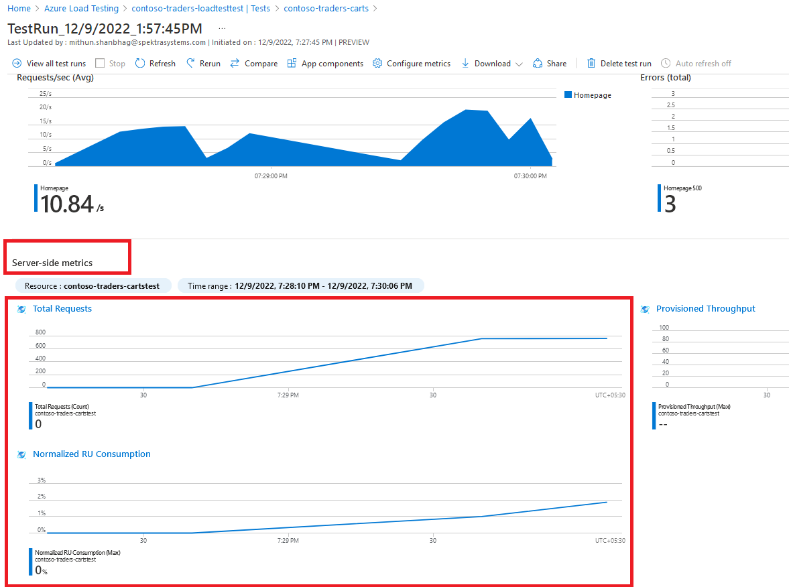

5. You can also revisit the earlier metric charts in ACA. It'll now have updated with the latest data after the load test. Of particular interest is the replica count chart of `Carts API`, which shows the instances auto-scaled out under increasing load. After load subsided, the instances auto-scaled back in to zero.

   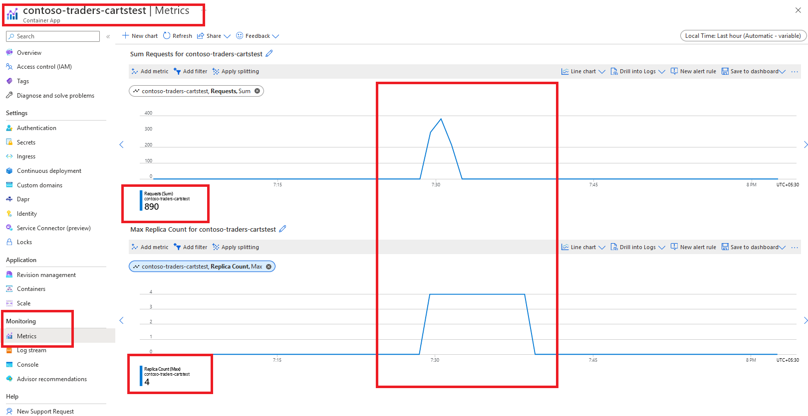

## Summary

In this demo, you got an overview of the autoscaling features of Azure services like ACA (Azure Container Apps). You can now head over to a [detailed demo](./technical-walkthrough.md) of AKS autoscaling.
